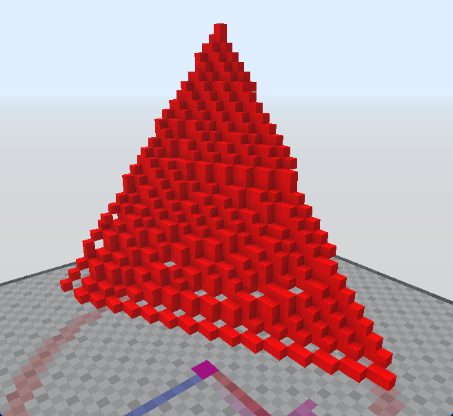

# /AbnormalTriangle
Makes a triangle from three points. The resulting triangle may have holes.

If no arguments are added, block is inferred from your current hand and the server will ask for the block positions interactively.

Aliases: `/triangle`, `/tri`