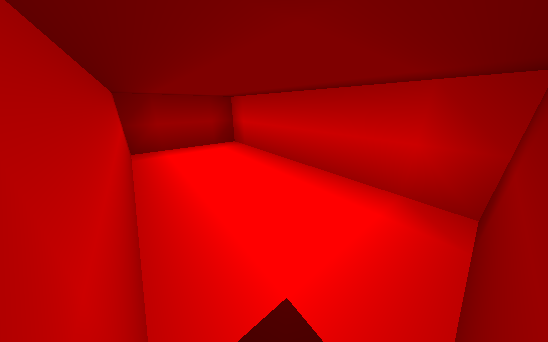
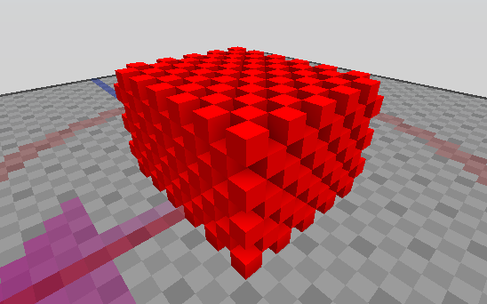

# /Cuboid
Makes a cuboid on two positions.

If no arguments are added, block is inferred from your current hand and the server will ask for the block positions interactively.

Aliases: `/z`

## Modes
Cuboids can created with modifiers. These affect how the resulting cuboid looks. `Solid` is the default mode.

To use a mode, the command must be issued with a block ID and the mode's name. i.e.: `/cuboid 9 hollow` to make a red hollow cuboid. If `hand` is given for the block ID, the block on hand will be used instead.

### Hollow
Creates a hollow cuboid. The inside of the cuboid will be empty.

### Walls
Creates a hollow cuboid without a floor or roof.

### Holes
Creates a cuboid with a checkerboard pattern.

