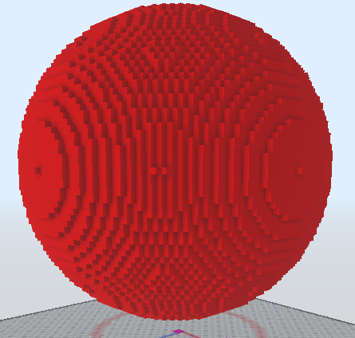

# /SphereSlow
Makes a sphere from a center point and a radius.

If no arguments are added, block is inferred from your current hand and the server will ask for the block positions interactively.

Aliases: `/sphere`, `/sp`