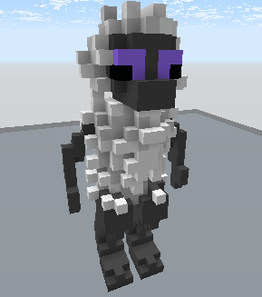

# /FurrierTransform

Adds extra blocks within a selection to make it look fluffier.

Command layout: `/furriertransform &block:block position:position1 position:position2`

Aliases: `/furrier`, `/fur`

## Parameters

### &block:block

The `&block:block` parameter is the block type created when fur grows. If it's air then the block will be derived from the block used to grow fur on.
