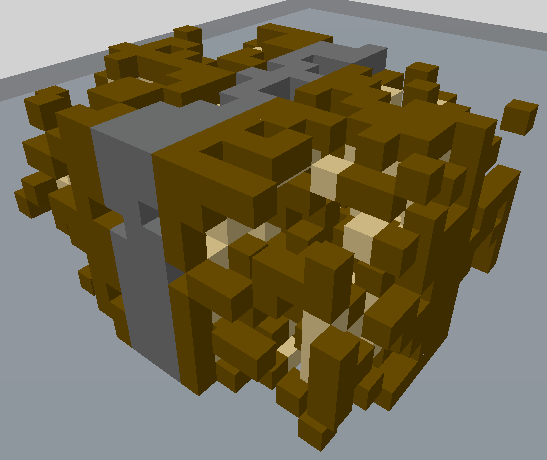

# /CourierTransform

Transforma una selección de bloques de una manera que parece dañada durante el transito.

Alias: `/courier`

## Comportamiento

Se toman varios pasos para simular el resultado de la manipulación aproximada de un objeto durante la transacción.

### Destrucción y gravedad

Este paso es el primero. Los bloques dentro de la selección tienen la posibilidad de ser dañados. Cuando un bloque es dañado, cae al vóxel más bajo disponible o sea reemplazado por el bloque sostenido.

Un bloque solo se ve afectado por la gravedad de 32 bloques. Si un bloque que cae no puede encontrar un bloque adecuado en el que aterrizar puede flotar.

### Explotando

Este paso se ha dado el último. De cada uno de los 8 maíz, los bloques tienen la oportunidad de acercarse más al centro de la selección.
