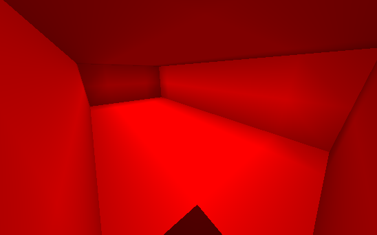

# /Cuboid

Hace un cuboide en dos posiciones.

Si no se añaden argumentos, el bloque es inferior de la mano actual y el servidor pedirá las posiciones del bloque interactivamente.

Alias: `/z`

## Modos

Cuboids puede crear con modificadores. Esto afecta a la apariencia del cuboide resultante. `Solid` es el modo por defecto.

Para usar un modo, el comando debe ser emitido con un bloque ID y el nombre del modo. i.e.e.: `/cuboid 9 hueco para hacer un cuboide hueco rojo. Si se da `hand\` para el bloque ID, el bloque a mano se usará en su lugar.

### Hueco

Crea un cuboide hueco. El interior del cuboide estará vacío.

### Muros

Crea un cuboide hueco sin suelo ni techo.

### Agujeros

Crea un cuboide con un patrón de tablero.

