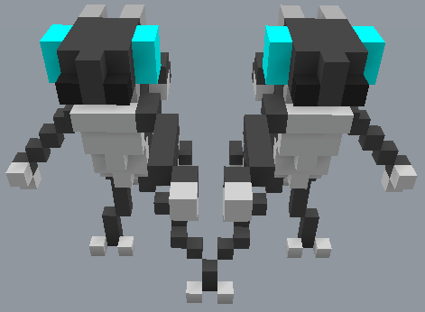

# /Transformación Posicional

Transforma una selección de bloques. Se puede utilizar para mover, copiar, voltear o girar una selección de bloques. Con los parámetros por defecto, moverá una selección de bloques sin transformaciones adicionales aplicadas.

Diseño del comando: `/positionaltransform &enum:mode &enum:rotation &enum:flipAxis position:positionStart position:positionEnd position:offsetPosition position:pastePosition`

Alias: `/move`

## Modos

El parámetro `&enum:mode` se utiliza como modo base. Es `move` por defecto,

- `move` Mueve la selección limpiando la selección con aire.
- `copiar` reserva la selección original.
- `moveAir` Igual que `move` pero pega bloques de aire sobre el área de pegado.
- `copyAir` Igual que `copiar` pero pega bloques de aire sobre el área de pegado.

## Espinar

Una selección puede girar en sentido horario o en sentido contrario a las agujas del reloj usando el parámetro `&enum:rotation`.

- `ninguno` Ninguna transformación de rotación aplicada.
- `clockwise`
- `counterclockwise`

Ejemplo: `/positionaltransform mueve en sentido horario`. Marca la selección en el sentido del reloj.

## Volteando

Ejemplo: `/positionaltransform copy none x`. Copia y vuelca una selección por su eje X.

- `ninguno` No se ha aplicado ninguna transformacin de vuelta.
- `x` Voltear por x axis.
- `y` Voltear por eje y.
- `z` Voltear por z eje.
