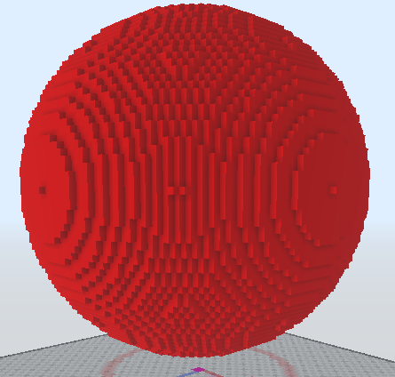

# /SphereSlow

Hace una esfera desde un punto central y un radio.

Si no se añaden argumentos, el bloque es inferior de la mano actual y el servidor pedirá las posiciones del bloque interactivamente.

Alias: `/sphere`, `/sp`
