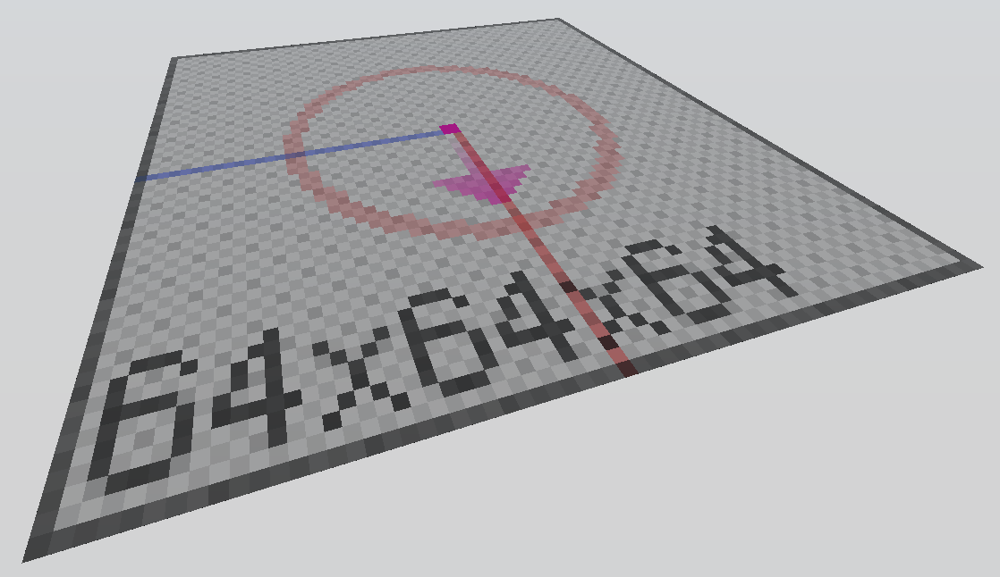

# Plantillas

## builder (Constructor)

Utilizado como plantilla predeterminada para la construcción que incluye una paleta y líneas de ejes.

## empty (Vacío)

Una plantilla vacía. Utilizado por describir los giros y el nivel del centro.

## animation (Animación)

Una plantilla usada para crear animaciones. Vea `/help animation`.
