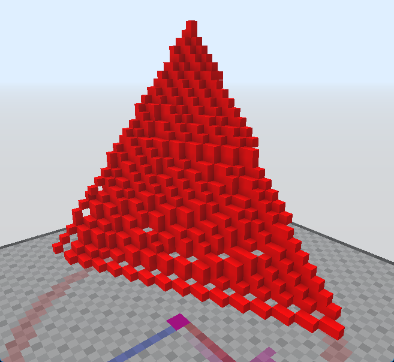

# /AbnormalTriangle

Cria um triângulo a partir de três pontos. O triângulo resultante pode ter buracos.

Se nenhum argumento for fornecido, o bloco será inferido a partir do que você está segurando, e o servidor solicitará interativamente as posições dos blocos.

Aliases: `/triangle`, `/tri`
