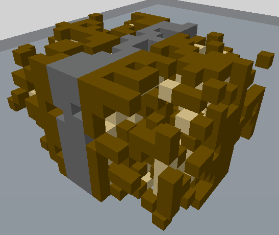

# /CourierTransform

Transforma uma seleção de blocos de maneira que pareça ter sido danificada durante o transporte.

Aliases: `/courier`

## Comportamento

Vários passos são realizados para simular o resultado de manuseio bruto de um objeto durante o transporte.

### Destruição e gravidade

Este passo é realizado primeiro. Blocos dentro da seleção têm chance de serem danificados. Quando um bloco é danificado, ele cai para o voxel mais baixo disponível ou é substituído pelo bloco que você está segurando.

Um bloco é afetado pela gravidade apenas por 32 blocos. Se um bloco em queda não encontrar um bloco adequado para aterrissar, ele pode flutuar.

### Implosão

Este passo é realizado por último. De cada um dos 8 cantos, os blocos têm chance de serem trazidos mais próximos do centro da seleção.
