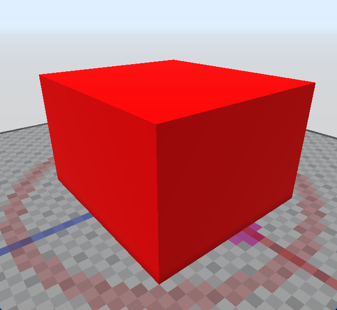
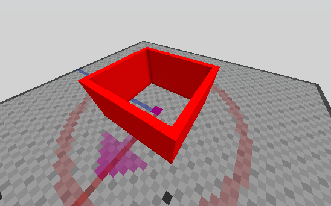

# /Cuboid

Cria um cuboide a partir de duas posições.

Se nenhum argumento for fornecido, o bloco será inferido da sua mão atual e o servidor pedirá interativamente as posições dos blocos.

Aliases: `/z`

## Modos

Cuboides podem ser criados com modificadores. Estes afetam a aparência do cuboide resultante. `Sólido` é o modo padrão.

Para usar um modo, o comando deve ser emitido com um ID de bloco e o nome do modo, por exemplo: `/cuboid 9 hollow` para criar um cuboide vermelho oco. Se `hand` for fornecido como ID do bloco, será usado o bloco que você está segurando.

### Hollow (Oco)

Cria um cuboide oco. O interior do cuboide ficará vazio.

### Walls (Paredes)

Cria um cuboide oco sem piso ou teto.

### Holes (Buracos)

Cria um cuboide com padrão de tabuleiro de xadrez.

