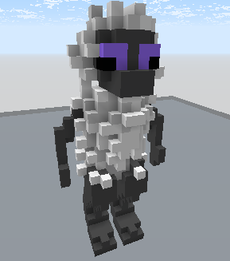

# /FurrierTransform

Adiciona blocos extras dentro de uma seleção para deixá-la mais fofinha.

Formato do comando: `/furriertransform &block:block position:position1 position:position2`

Aliases: `/furrier`, `/fur`

## Parameters

### &block:block

O parâmetro `&block:block` define o tipo de bloco criado quando o "pelo" cresce. Se for ar, o bloco será derivado do bloco sobre o qual o pelo está sendo adicionado.
