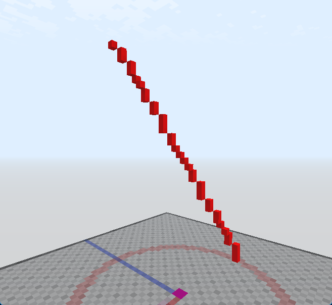

# /Line

Cria uma linha entre dois pontos.

Se nenhum argumento for fornecido, o bloco será inferido da sua mão atual e o servidor pedirá interativamente as posições dos blocos.

Aliases: `l`, `/ln`