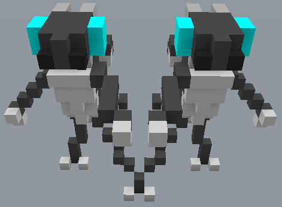

# /PositionalTransform

Transforma uma seleção de blocos. Pode ser usado para mover, copiar, espelhar ou girar uma seleção de blocos. Pode ser usado para mover, copiar, espelhar ou girar uma seleção de blocos.

Formato do comando: `/positionaltransform &enum:mode &enum:rotation &enum:flipAxis position:positionStart position:positionEnd position:offsetPosition position:pastePosition`

Aliases: `/move`

## Modos

O parâmetro `&enum:mode` é usado como modo base. Por padrão, é `move`:

- `move` Move a seleção limpando a área com ar.
- `copy` Preserva a seleção original.
- `moveAir` Igual ao `move`, mas cola blocos de ar na área de destino.
- `copyAir` Igual ao `copy`, mas cola blocos de ar na área de destino.

## Spinning

Uma seleção pode ser girada no sentido horário ou anti-horário usando o parâmetro `&enum:rotation`.

- `none` Nenhuma rotação aplicada.
- `clockwise` Sentido horário.
- `counterclockwise` Sentido anti-horário.

Exemplo: `/positionaltransform move clockwise`. Gira a seleção no sentido horário.

## Flipping

Exemplo: `/positionaltransform copy none x`. Copia e espelha uma seleção pelo eixo X.

- `none` Nenhum espelhamento aplicado.
- `x` Espelhar pelo eixo X.
- `y` Espelhar pelo eixo Y.
- `z` Espelhar pelo eixo Z.
