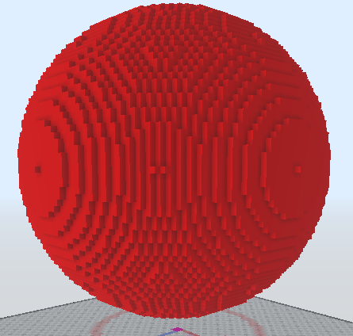

# /SphereSlow

Cria uma esfera a partir de um ponto central e um raio.

Se nenhum argumento for fornecido, o bloco será inferido a partir do que você está segurando, e o servidor solicitará interativamente as posições dos blocos.

Aliases: `/sphere`, `/sp`
