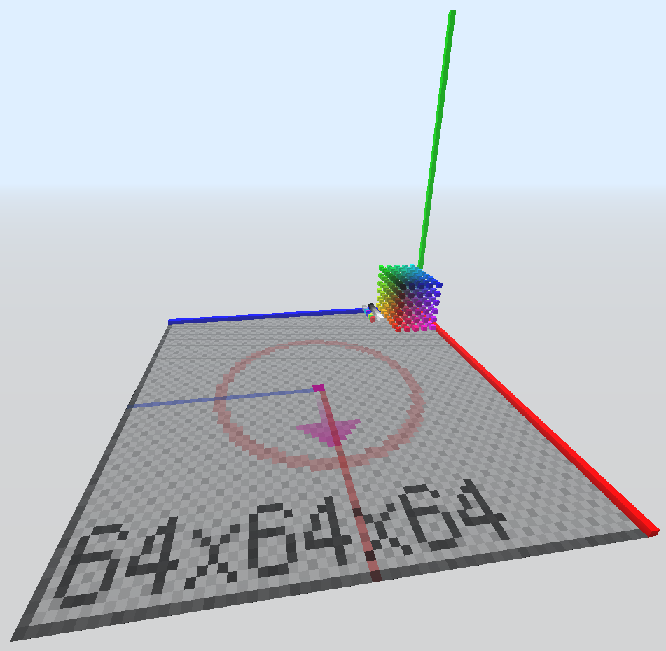
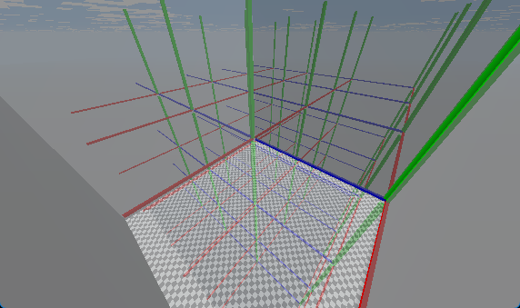

# Templates

## builder (construtor)

Usado como template padrão para construção, incluindo paleta de cores e linhas de eixo.

## empty (vazio)

Um template vazio. Usado em turnos de descrição e no nível hub.

## animation (animação)

Um template usado para criar animações. Veja `/help animation`.
